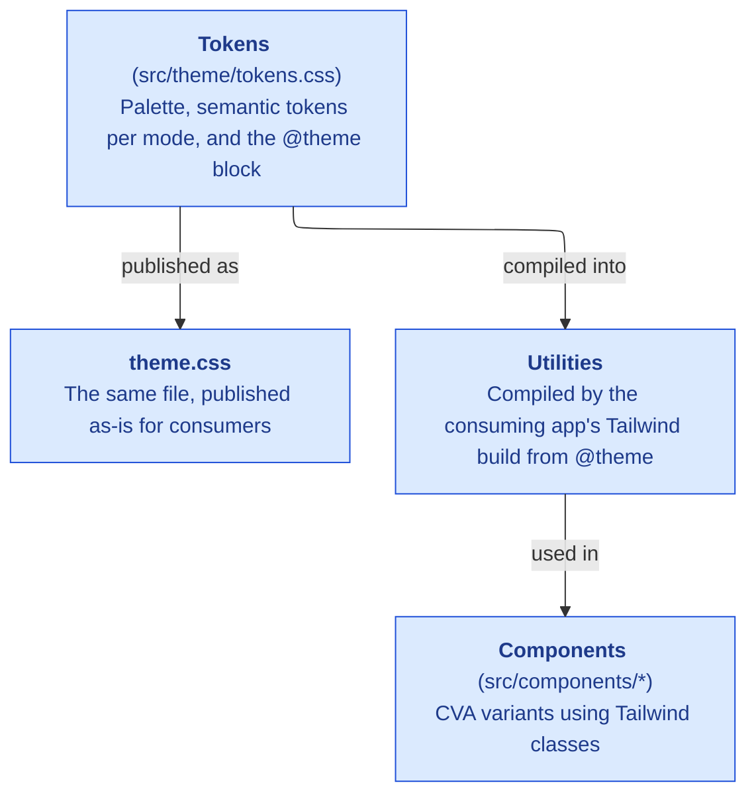

# Design Tokens

Design tokens, component patterns, and styling architecture for the design system.

## Overview

The design system is built on:

- **`src/theme/tokens.css`**: Source of truth for color tokens
- **CSS Variables**: Runtime theming with light/dark modes
- **Tailwind CSS**: Utilities declared by the same file, via `@theme`
- **CVA**: Type-safe component variants



---

## Token Architecture

### The Three Contexts

Tokens are organized by what CSS property they affect:

| Context  | Prefix    | Usage                    |
|----------|-----------|--------------------------|
| `bg`     | `bg-`     | Background colors        |
| `fg`     | `fg-`     | Foreground/text colors   |
| `border` | `border-` | Border colors            |

### Hierarchy Tokens (Neutral)

For non-semantic UI elements:

| Token      | Usage                              |
|------------|------------------------------------|
| `strong`   | High emphasis, primary actions     |
| `normal`   | Default, body content              |
| `subtle`   | Low emphasis, secondary content    |

Example classes:
- `bg-bg-normal` - Default background
- `text-fg-subtle` - Muted text
- `border-border-strong` - Emphasized border

### Feedback Tokens (Semantic)

For meaningful colors:

| Token     | Color   | Usage                        |
|-----------|---------|------------------------------|
| `brand`   | Ocean   | Primary actions, brand color |
| `success` | Emerald | Positive states, completed   |
| `warning` | Topaz   | Caution, attention needed    |
| `danger`  | Ruby    | Destructive, errors          |

Each feedback token has three intensities:
- `{token}-subtle` - Soft background (e.g., `bg-brand-subtle`)
- `{token}` - Default (e.g., `bg-brand`)
- `{token}-strong` - High emphasis (e.g., `bg-brand-strong`)

### Interactive States

Every token has state variants:

| State      | Suffix      | Usage                |
|------------|-------------|----------------------|
| Default    | (none)      | Resting state        |
| Hovered    | `-hovered`  | Mouse over           |
| Pressed    | `-pressed`  | Active/clicking      |
| Disabled   | `-disabled` | Non-interactive      |

Example: `bg-brand`, `bg-brand-hovered`, `bg-brand-pressed`, `bg-brand-disabled`

### Foreground "On" Tokens

For text on colored backgrounds:

```tsx
// Text that appears ON a brand background
<div className="bg-bg-brand text-fg-on-brand">
  White text on blue
</div>

// Text that appears ON a subtle brand background
<div className="bg-bg-brand-subtle text-fg-on-brand-subtle">
  Dark blue text on light blue
</div>
```

---

## Color Palette

The theme uses named color scales:

| Name    | Hue   | Usage          |
|---------|-------|----------------|
| Slate   | Gray  | Neutral UI     |
| Ocean   | Blue  | Brand color    |
| Emerald | Green | Success states |
| Topaz   | Amber | Warning states |
| Ruby    | Red   | Danger states  |

Each scale has values from 50 (lightest) to 950 (darkest).

---

## Z-Index Scale

Stacking is a named token scale (the `--z-index-*` entries in `src/theme/tokens.css`), not ad-hoc `z-[n]`. Use the token; never a raw value. Tailwind v4 accepts bare values like `z-10` whatever the theme says, so this one is convention rather than a compile error.

| Token              | Value | Layer                          |
|--------------------|-------|--------------------------------|
| `z-content-sticky` | 10    | Sticky headers within content  |
| `z-app-bar`        | 30    | The global app header / nav    |
| `z-sheet`          | 50    | Slide-in sheets                |
| `z-popover`        | 60    | Popovers, hover-cards, selects |
| `z-modal`          | 70    | Modal dialogs                  |
| `z-toast`          | 9999  | Toasts (always on top)         |

The order encodes the rule: a popover opened from a modal sits above it; toasts sit above everything.

---

## Token discipline

The token vocabulary above is the *whole* vocabulary. Two failure modes recur, and both render as nothing or as off-system color — treat them as bugs, not style choices.

**No phantom tokens.** Only the families listed here exist. These look plausible but are NOT defined, and silently produce no style:

| Wrote (invalid)        | Meant                                       |
|------------------------|---------------------------------------------|
| `*-emphasis`           | `*-strong` (e.g. `bg-bg-strong`)            |
| `fg-muted`             | `fg-subtle`                                 |
| `fg-info`, `fg-accent` | `fg-brand` (there is no info/accent intent) |
| `fg-on-emphasis`       | `fg-on-strong`                              |

**No raw palette.** Never use Tailwind scale colors (`bg-white`, `border-gray-300`, `text-red-600`, `text-blue-500`). They bypass theming and break dark mode. Reach for the semantic token: `bg-bg-normal`, `border-border-normal`, `text-fg-danger`, `text-fg-brand`.

**Every fill has an `fg-on-*` pair.** Text placed on a colored fill uses the matching `fg-on-*` token for legible contrast — `bg-bg-brand` → `text-fg-on-brand`, `bg-bg-strong` → `text-fg-on-strong`, `bg-bg-success-subtle` → `text-fg-on-success-subtle`. Reaching for a plain `fg-*` on a colored fill is the most-missed half of the palette.

**Focus rings use `ring-focus-ring`.** There is one purpose-built focus token (`focus-ring`, an ocean hue). Keyboard focus is `focus-visible:ring-2 focus-visible:ring-focus-ring` — not `ring-border-brand`, not `ring-border-strong`. The global `:focus-visible` rule in `base.css` applies it by default, so most elements need no per-component ring at all.

**`font-sans` is not Inter.** The config defines no `fontFamily` key; Inter / JetBrains Mono apply only through the `body { font-family: var(--font-sans) }` cascade. The `font-sans` / `font-mono` utilities resolve to Tailwind's *default* stacks — avoid them and inherit the body font instead.

---

## Component API

### Core Props: `variant` + `intent`

Components use two orthogonal props:

```tsx
// variant: visual treatment (how it looks)
// intent: semantic meaning (what it means)

<Button variant="solid" intent="danger">Delete</Button>
<Button variant="outline" intent="success">Approve</Button>
<Badge variant="soft" intent="warning">Pending</Badge>
```

### Variant (Visual Treatment)

Values are component-specific:

| Component | Variants                            |
|-----------|-------------------------------------|
| Button    | `solid`, `outline`, `ghost`, `link` |
| Badge     | `solid`, `soft`, `outline`          |

### Intent (Semantic Meaning)

Consistent across all components:

| Intent    | Usage                          | Color   |
|-----------|--------------------------------|---------|
| `neutral` | Default, no special meaning    | Brand   |
| `danger`  | Destructive actions, errors    | Ruby    |
| `success` | Positive states, confirmations | Emerald |
| `warning` | Caution, needs attention       | Topaz   |

### Size Scale

```tsx
size: 'xs' | 'sm' | 'default' | 'lg' | 'xl' | 'icon'
```

| Size      | Button Height | Usage                      |
|-----------|---------------|----------------------------|
| `xs`      | 28px (h-7)    | Inline actions, tight UIs  |
| `sm`      | 32px (h-8)    | Compact UIs, table actions |
| `default` | 36px (h-9)    | Standard buttons           |
| `lg`      | 40px (h-10)   | Emphasized actions         |
| `xl`      | 48px (h-12)   | Hero CTAs                  |
| `icon`    | 36px × 36px   | Icon-only buttons          |

### State Props

```tsx
<Button disabled>Can't click</Button>
<Button loading>Saving...</Button>
```

### Polymorphism: `asChild`

Render component styles on a different element:

```tsx
<Button asChild>
  <Link to="/dashboard">Dashboard</Link>
</Button>
```

---

## Usage Examples

### Buttons

```tsx
// Primary action (default)
<Button>Save Changes</Button>

// Secondary action
<Button variant="outline">Cancel</Button>

// Destructive action
<Button intent="danger">Delete Account</Button>

// Ghost button for icons
<Button variant="ghost" size="icon">
  <Icon />
</Button>
```

### Badges

```tsx
// Status indicators
<Badge intent="success">Completed</Badge>
<Badge intent="warning">Pending</Badge>
<Badge intent="danger">Overdue</Badge>

// Soft variant for subtle labels
<Badge variant="soft">Category</Badge>
<Badge variant="soft" intent="success">Paid</Badge>
```

### Direct Token Usage

```tsx
// Using tokens directly in custom components
<div className="bg-bg-subtle border border-border-normal rounded-lg p-4">
  <h3 className="text-fg-strong font-semibold">Title</h3>
  <p className="text-fg-normal">Body text</p>
  <span className="text-fg-subtle text-sm">Caption</span>
</div>
```

---

## File Structure

```
src/
├── theme/
│   ├── tokens.css         # Source of truth: palette, tokens, @theme
│   ├── schema.ts          # The naming vocabulary, as types
│   ├── schema.ts          # TypeScript types for tokens
│   └── index.ts           # Exports
├── styles/
│   └── base.css           # Tailwind imports + base styles
├── components/
│   ├── Button/
│   ├── Badge/
│   ├── Input/
│   └── ...
└── lib/
    └── utils.ts           # cn() helper
```

### Import Order

```css
/* In your CSS entry point: */
@import "tailwindcss";
@import "@sixthshift/design-system/theme.css";
```

---

## Dark Mode

Dark mode is enabled via a data attribute:

```html
<html data-theme="dark">
```

All tokens automatically switch values. No additional classes needed.

---

## Typography

### Font Families

| Token         | Value          | Usage              |
|---------------|----------------|--------------------|
| `--font-sans` | System/Inter   | UI text, body copy |
| `--font-mono` | JetBrains Mono | Code, numbers      |

### Type Scale

Standard Tailwind type scale (`text-xs` through `text-5xl`).

---

## Spacing & Layout

Uses standard Tailwind spacing based on 4px (0.25rem) increments.

### Content Widths

| Token     | Width  | Tailwind     | Use Case                    |
|-----------|--------|--------------|----------------------------|
| Narrow    | 640px  | `max-w-xl`   | Forms, settings            |
| Default   | 768px  | `max-w-3xl`  | Lists, reading content     |
| Wide      | 1024px | `max-w-5xl`  | Data tables, grids         |
| Full      | 100%   | `max-w-full` | Dashboard layouts          |

---

## Resources

- [Tailwind CSS](https://tailwindcss.com)
- [CVA (Class Variance Authority)](https://cva.style)
- [Radix UI](https://radix-ui.com) - Primitives foundation
